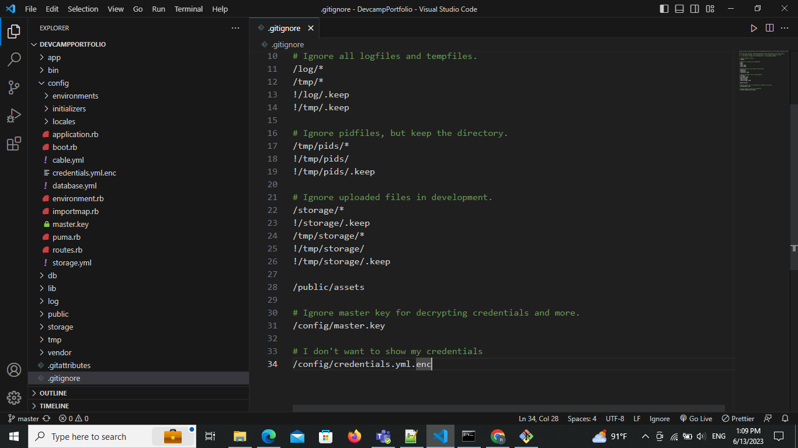

# README
> this is a ruby on rails app that allows users to create their own portfolios
### Features
- Real time chat engine for comment
- Blog
- Portfolio
- Drag and drop interface

### Code Exampe
```ruby
def my_method
    puts 'nothing'
end
```
```javascript
let sayhi=()=>{
    alert('hi');
}
```